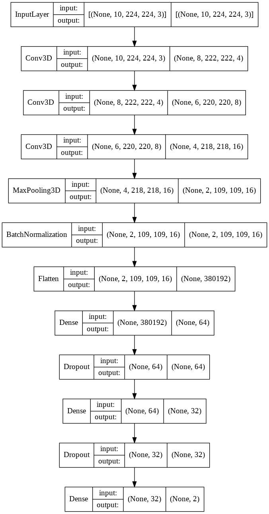

# conv3d_v1

Sequential Conv3D model.

## Notebook

[conv3d_v1.ipynb](https://github.com/werlang/emolearn-ml-model/blob/main/conv3d_v1/conv3d_v1.ipynb)

## Best weights

[2020-8-25-18-33-42-conv3d-1st-try/004.h5](https://drive.google.com/file/d/1-7rH_p8JPH-VYcjXPhu_Axcs60I3NUIb/view?usp=sharing)

## Performance

| Accuracy |   F1 |
| -------: | ---: |
|   0.7492 |    - |

## Plot model

