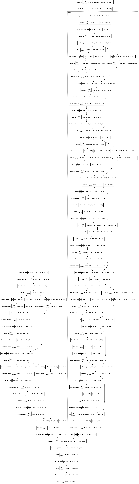

# time_v1

Fusion network:
* Bidirectional LSTM with skip connections network for training OpenFace features.
* TimeDistributed Conv2D with skip-connections for training videos.

Fusion done using a BLSTM layer after concatenarion layer.

## Notebook

[time_v1.ipynb](https://github.com/werlang/emolearn-ml-model/blob/main/time_v1/time_v1.ipynb)

## Best weights

[2021-1-6-22-56-20-fusion-1e/022.h5](https://drive.google.com/file/d/10LdDkOL0RdoXESY5QC6kIj_ZbBaZTk6-/view?usp=sharing)

## Performance

| Accuracy |   F1 |
| -------: | ---: |
|   0.6733 |    - |

## Plot model

