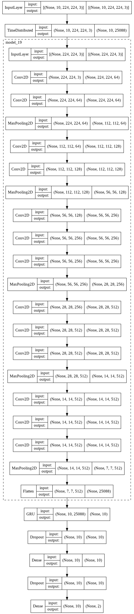

# vgg_fine_tune_v6

VGG16 network pre-trained on VGG-Face database. GRU layers are used frames from videos.

## Notebook

[vgg_fine_tune_v6.ipynb](https://github.com/werlang/emolearn-ml-model/blob/main/vgg_fine_tune_v6/vgg_fine_tune_v6.ipynb)

## Best weights

[2020-7-16-21-51-7-fine-tune-images-vgg-gru-striding-2/021.h5](https://drive.google.com/file/d/1-jdoX6Bf56LobF4xJqIezkO7ByTT8fwY/view?usp=sharing)

## Performance

| Accuracy | F1 |
| --- | --- |
| 0.6362 | 0.6250 |

## Plot model

